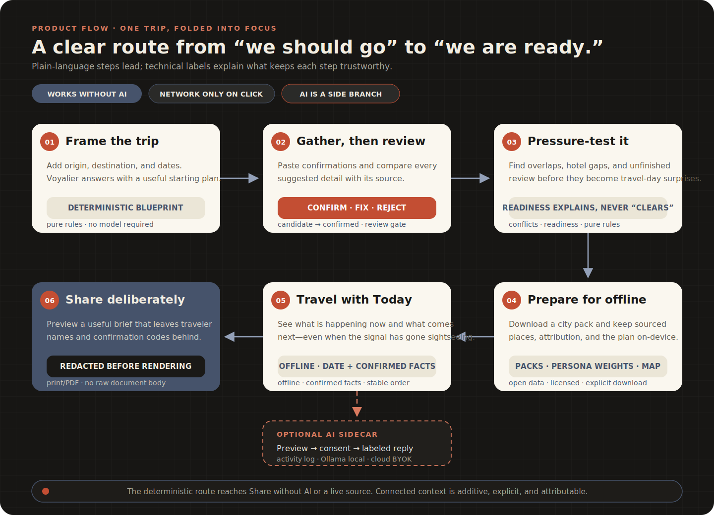
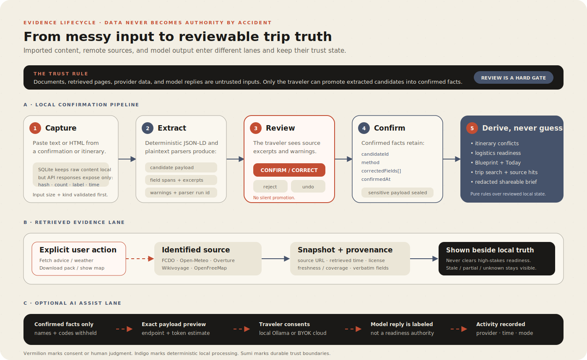
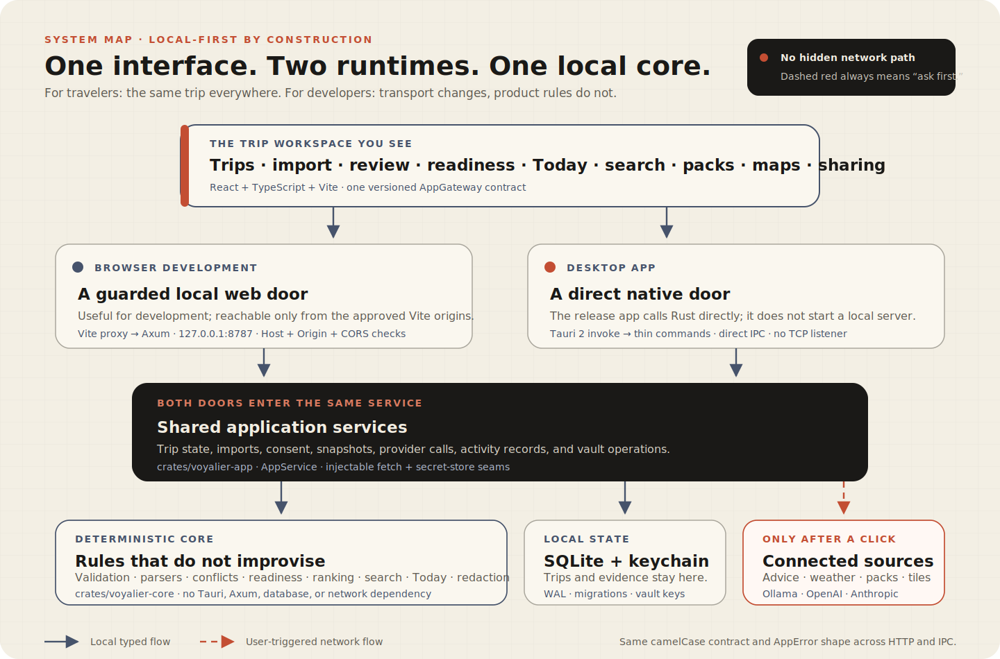

<p align="center">
  
</p>

<h1 align="center">Voyalier</h1>

<p align="center"><em>One trip, folded into focus.</em></p>

<p align="center">
  A calm, local-first trip workspace for the reservations, research tabs,<br>
  weather checks, half-made plans, and one PDF named <code>boarding-pass-FINAL.pdf</code>.<br>
  Voyalier turns the pile into a reviewed itinerary, an honest readiness check,<br>
  and a brief you can share without also sharing your confirmation codes.
</p>

<p align="center">
  <strong>No account</strong>&nbsp;&nbsp;·&nbsp;&nbsp;<strong>No silent uploads</strong>&nbsp;&nbsp;·&nbsp;&nbsp;<strong>No AI required</strong>
</p>

<p align="center">
  <a href="https://github.com/udhawan97/Voyalier/actions/workflows/ci.yml"></a>
  
  
  
  <a href="LICENSE"></a>
  
</p>

<p align="center">
  <sub>折&nbsp;&nbsp;one route, folded&nbsp;&nbsp;·&nbsp;&nbsp;間&nbsp;&nbsp;room to think&nbsp;&nbsp;·&nbsp;&nbsp;朱&nbsp;&nbsp;the waypoint&nbsp;&nbsp;·&nbsp;&nbsp;息&nbsp;&nbsp;motion with breath</sub>
</p>

<p align="center">
  <a href="#what-it-does"><kbd>&nbsp;✨&nbsp;Features&nbsp;</kbd></a>&nbsp;
  <a href="#run-it"><kbd>&nbsp;🚀&nbsp;Run&nbsp;it&nbsp;</kbd></a>&nbsp;
  <a href="#privacy"><kbd>&nbsp;🔒&nbsp;Privacy&nbsp;</kbd></a>&nbsp;
  <a href="#under-the-hood"><kbd>&nbsp;⚙️&nbsp;Under&nbsp;the&nbsp;hood&nbsp;</kbd></a>&nbsp;
  <a href="https://udhawan97.github.io/Voyalier/"><kbd>&nbsp;📖&nbsp;Docs&nbsp;</kbd></a>
</p>

> [!NOTE]
> Voyalier is a **source-only beta**, built in the open. The working app already covers trip creation, deterministic planning, confirmation review, conflicts, readiness, official advice, weather, offline city packs, persona recommendations, Today, maps, encrypted local storage, redacted sharing, and optional Ollama/OpenAI/Anthropic assistance. Signed and notarized installers are still waiting for the traditional travel document of software distribution: paid certificates.

## The route

A “simple trip” is rarely simple. It is seventeen tabs, two time zones, a hotel
email, a screenshot of a train, a note that says “museum Tuesday?” and a group
chat whose final decision was apparently a thumbs-up from someone named Alex.

Traditional itinerary apps are good at making colored rectangles. AI trip
planners are good at sounding certain. Neither is especially comforting when
the rectangle overlaps your flight or the certainty was invented six tokens
ago.

Voyalier takes a different route: **keep the trip local, keep the evidence
attached, and keep the traveler in charge**. Import details become candidates,
not facts. Official information keeps its source and retrieval time. Rules find
the conflicts. AI is optional, previewed, and never promoted to border agent,
meteorologist, doctor, or booking clerk.

<p align="center">
  
</p>

## What it does

The useful parts work without a paid AI key. The connected parts ask first.

|     | Do this                                                                                          | Get this                                                                                                   |
| :-: | ------------------------------------------------------------------------------------------------ | ---------------------------------------------------------------------------------------------------------- |
| 🧭  | **Frame the trip** — add origin, destination, and dates                                          | A deterministic Blueprint instead of a blank canvas asking you to “start dreaming”                         |
| 📥  | **Bring the confirmations** — paste reservation text or structured HTML                          | Candidate flights and stays with source excerpts, warnings, and zero silent promotion                      |
| ✅  | **Review the facts** — confirm, correct, reject, or undo                                         | A trusted itinerary whose mistakes can be traced back to the source instead of blamed on “the algorithm”   |
| 🧩  | **Pressure-test the plan** — check overlaps, lodging gaps, and pending review                    | Readiness that explains what is missing without pretending it knows whether a government will admit you    |
| 🌦️  | **Fetch live context** — request official advice or destination weather                          | Dated, attributed snapshots with honest stale, partial, and unavailable states                             |
| 🗺️  | **Discover locally** — download an open-data city pack, choose persona weights, and show the map | Ranked places with source, license, score, and “because” reasons — not a mystery listicle in a trench coat |
| 🔍  | **Find anything** — search the trip’s saved documents and confirmed facts                        | Local results with provenance and transparent occurrence-based ranking                                     |
| 🕰️  | **Travel with Today** — open the trip before or during the journey                               | A stable offline “now / next” view derived from confirmed facts and the current date                       |
| ✨  | **Ask carefully** — preview an Ollama, OpenAI, or Anthropic request                              | Optional assistance with the exact outbound payload, withheld fields, token estimate, and activity record  |
| 🔐  | **Lock it down** — use the OS keychain or add a passphrase                                       | Sensitive trip evidence sealed at rest, with no recovery theatre if the passphrase is forgotten            |
| 🧾  | **Share deliberately** — preview the traveler brief and print or save it as PDF                  | A useful handoff that excludes names and confirmation codes by construction                                |

<details>
<summary>&nbsp;📋&nbsp; The full capability list, without the brochure voice</summary>

<br>

| Area                | What Voyalier does                                                                                                                                |
| ------------------- | ------------------------------------------------------------------------------------------------------------------------------------------------- |
| **Trips**           | Create, update, archive, delete, and persist trips with a deterministic Blueprint                                                                 |
| **Confirmations**   | Import pasted text or HTML; detect JSON-LD and plain-text flight/lodging facts; retain parser runs, field spans, excerpts, and warnings           |
| **Review**          | Keep extracted candidates pending until the traveler confirms or corrects them; reject candidates or undo confirmed facts back to review          |
| **Itinerary**       | Order confirmed flights and stays; flag flight overlaps, lodging overlaps, and uncovered-night gaps without blocking the traveler                 |
| **Readiness**       | Roll up logistics checks and surface link-only official entry/health resources without making authoritative claims                                |
| **Official advice** | Fetch a consented, dated GOV.UK FCDO snapshot with attribution, source URL, update metadata, and staleness handling                               |
| **Weather**         | Fetch a consented Open-Meteo outlook with resolved place, trip-window coverage, retrieval time, and honest forecast-horizon limits                |
| **Offline packs**   | Browse a validated catalog and download per-trip Overture + Wikivoyage packs from GitHub Releases with separate layer licenses                    |
| **Recommendations** | Rank downloaded places with transparent persona weights, scores, reasons, provenance, and a cross-dimension wildcard                              |
| **Map**             | Lazy-load a consent-gated MapLibre/OpenFreeMap view; request no tiles before the traveler selects **Show map**                                    |
| **Search**          | Scan stored source documents and confirmed facts locally, returning snippets and provenance with deterministic ranking                            |
| **Today**           | Build an offline upcoming/active/completed view with today’s anchors and the next known event                                                     |
| **AI assist**       | Detect local Ollama; configure BYOK OpenAI/Anthropic; preview the exact redacted request; run only after consent; record metadata-only activity   |
| **Vault**           | Seal source text, pending evidence, and sensitive fact payloads with an OS-keychain data key; optionally wrap it with a local Argon2id passphrase |
| **Share**           | Generate a redaction-first printable brief from confirmed facts; names and confirmation codes never enter the output model                        |
| **Accessibility**   | Support keyboard flows, focus containment, reduced motion, semantic labeling, contrast review, and automated axe-core gates                       |

</details>

## Run it

There is no polished installer yet. For now, Voyalier is a carry-on you assemble
yourself — fortunately, it has fewer pieces than an airport lounge chair.

Requirements:

- Node.js 24+
- pnpm 11+
- Current stable Rust toolchain with `rustfmt` and `clippy`

```bash
git clone https://github.com/udhawan97/Voyalier.git
cd Voyalier
make bootstrap
make dev
```

Open `http://127.0.0.1:5173`. The Vite app proxies `/api` to the guarded Axum
service at `http://127.0.0.1:8787`.

> [!TIP]
> Want to inspect the interface without keeping a boarding pass safe? The component tests use a deterministic in-memory gateway, so fixtures can exercise the full UI without touching your keychain, database, or network.

<details>
<summary>&nbsp;🛠️&nbsp; Useful development commands</summary>

<br>

```bash
pnpm dev:web      # React interface only
pnpm dev:docs     # Astro/Starlight documentation
make check        # TypeScript, tests, builds, Rust fmt/clippy/tests
```

The desktop app uses the same React interface through direct Tauri IPC. It does
not start the Axum server or bind a TCP port in release mode.

</details>

## Four ways it can think

Only one of them requires giving a model anything, and even then Voyalier shows
you the envelope before it leaves the building.

| Mode                   | Contract                                                                                                                       |
| ---------------------- | ------------------------------------------------------------------------------------------------------------------------------ |
| **Local intelligence** | Deterministic parsing, validation, search, readiness, ranking, Today, and brief redaction. Always the baseline.                |
| **Offline snapshot**   | Saved trips, evidence, downloaded packs, and derived views. Stale live facts stay labeled rather than aging into folklore.     |
| **On-device AI**       | Optional Ollama on localhost. No key, no cloud, and never required for the product to be useful.                               |
| **Cloud AI**           | BYOK OpenAI or Anthropic after an exact redacted-payload preview. Keys stay in the OS keychain; every completed run is logged. |

## Privacy

Voyalier is local-first by architecture, not by a checkbox hidden under “More
settings.” Your confirmation code is not a networking opportunity.

- 🖥️ **The trip lives on your machine.** Trips, imported evidence, confirmed facts, packs, provider settings, and activity metadata are stored locally.
- 🛡️ **Sensitive evidence is sealed at rest.** The OS keychain protects the vault data key; an optional passphrase can wrap that key and lock the workspace between launches.
- 👀 **Imports are reviewed, not believed.** Parsed details remain candidates until you confirm or correct them.
- 📡 **Connected features wait for a click.** Advice, weather, city packs, maps, and AI requests do not quietly “refresh for your convenience.”
- ✂️ **Sharing starts with exclusion.** Traveler names and confirmation codes are removed while the brief is built, not painted over afterward.
- 📊 **Zero telemetry.** No analytics pipeline, shared provider account, ad profile, or inspirational heat map of where everyone wants to go.

<p align="center">
  
</p>

<details>
<summary>&nbsp;🔍&nbsp; The fine print — what can use the network</summary>

<br>

| Connection             | Trigger                      | What leaves the device                                                                                 |
| ---------------------- | ---------------------------- | ------------------------------------------------------------------------------------------------------ |
| **GOV.UK FCDO**        | **Fetch official advice**    | Selected country slug; the dated response is stored locally                                            |
| **Open-Meteo**         | **Fetch weather**            | Destination name for geocoding, then coordinates for the forecast                                      |
| **GitHub Releases**    | **Download for this trip**   | Requested public pack ID; no trip content is uploaded                                                  |
| **OpenFreeMap**        | **Show map**                 | Map viewport tile requests; trip records are not sent                                                  |
| **Ollama**             | **Run assist** after preview | Redacted payload to localhost only                                                                     |
| **OpenAI / Anthropic** | **Run assist** after preview | The exact redacted payload displayed in the consent step; the BYOK key is used only in the auth header |

Official entry, health, and safety sources outrank commercial, editorial,
community, and model content. AI can help explain a trip; it cannot clear one.

</details>

## Under the hood

_For contributors, privacy reviewers, and anyone who reads architecture diagrams
for fun. We see you._

|                       |                                                                                                                                                          |
| --------------------- | -------------------------------------------------------------------------------------------------------------------------------------------------------- |
| **Interface**         | React + TypeScript + Vite, shared by browser development and the Tauri desktop shell                                                                     |
| **Core**              | Framework-independent Rust rules for validation, parsing, readiness, itinerary checks, search, recommendations, Today, redaction, and vault cryptography |
| **Application layer** | `voyalier-app` orchestration, SQLite transactions, provider seams, keychain access, and encrypted persistence                                            |
| **Transports**        | Guarded Axum loopback HTTP for browser development · direct Tauri IPC for desktop                                                                        |
| **Storage**           | SQLite with WAL, foreign keys, busy timeout, and versioned migrations · OS keychain for BYOK and vault keys                                              |
| **Trust model**       | Documents, retrieved pages, provider data, and model replies are untrusted until the appropriate review or consent boundary                              |
| **Quality gates**     | TypeScript checks, React tests, Rust fmt/clippy/tests, desktop IPC round trips, accessibility checks, dependency review, and CodeQL                      |

<p align="center">
  
</p>

<details>
<summary>&nbsp;📁&nbsp; Project layout</summary>

<br>

```text
apps/
  web/                 React + Vite product interface
  desktop/             Thin Tauri 2 native shell
crates/
  voyalier-core/       Domain types, parsers, deterministic rules, validation
  voyalier-app/        SQLite-backed services, providers, vault, persistence
  voyalier-server/     Guarded Axum API for browser development
packages/
  brand/               Folded-route mark, lockup, and app-icon assets
  contracts/           Versioned TypeScript API/domain contract and mock
  ui/                  Shared palette, type, spacing, and motion tokens
docs-site/             Astro + Starlight public documentation
docs/                  Architecture, product, security, data, design, and tests
.github/                CI, Pages, security, pack-building, and release automation
```

</details>

<details>
<summary>&nbsp;🧠&nbsp; Why there are two transports</summary>

<br>

The UI speaks one `AppGateway` contract:

- Browser development sends same-origin JSON through Vite to Axum on
  `127.0.0.1:8787`, guarded by Host, Origin, and CORS checks.
- The desktop build selects the Tauri gateway and invokes the same Rust
  `AppService` directly — no local web server, no fixed-port listener.
- Component tests select an in-memory mock with deterministic fixtures.

That keeps product behavior in Rust services and domain rules instead of slowly
collecting three slightly different answers to “is this hotel night missing?”

</details>

See the full [architecture guide](docs/architecture/ARCHITECTURE.md),
[product brief](docs/product/PRODUCT_BRIEF.md),
[threat model](docs/security/THREAT_MODEL.md), and
[data-source policy](docs/data/DATA_SOURCES.md).

## Roadmap

The core trip loop is working: create → import → review → check → prepare → use
offline → share. Grounded intelligence and the first public-beta surfaces have
landed. The remaining work is less “invent the product” and more “make it safe
to hand to someone who has a flight tomorrow.”

- **Signed installers** — notarized macOS and signed Windows packages, checksums, and updater provenance
- **Offline map completion** — per-pack PMTiles so the map joins the rest of the trip when the Wi-Fi leaves first
- **More sourced readiness** — only where licensing, retrieval, and authority boundaries stay honest
- **Localization readiness** — product copy, dates, units, and accessibility across more travelers
- **Performance and support hardening** — larger trips, slower machines, clearer recovery paths, fewer reasons to open an issue from an airport floor

Live booking, payment, authoritative visa determinations, price prediction,
silent email ingestion, and real-time group collaboration remain deliberately
deferred. Voyalier would rather be reliably useful than theatrically omniscient.

See the full [roadmap](docs/roadmap/ROADMAP.md).

## Troubleshooting

<details>
<summary>The app says a connected feature is unavailable</summary>

<br>

Your saved trip still works. Advice, weather, pack downloads, maps, and cloud AI
are additive network features; retry the specific action when connected. Voyalier
does not reinterpret “could not fetch” as “everything is probably fine.”

</details>

<details>
<summary>On-device AI is not detected</summary>

<br>

Start Ollama, install at least one model, then select **Check for on-device AI**
again. AI is optional; every deterministic trip feature remains available
without it.

</details>

<details>
<summary>I forgot the vault passphrase</summary>

<br>

There is intentionally no recovery copy or backdoor. The passphrase never
leaves the device and is not stored. Back up the local data directory before
enabling passphrase protection, and store the passphrase somewhere you trust.

</details>

More help lives in the [troubleshooting guide](https://udhawan97.github.io/Voyalier/troubleshooting/).

## Contributing

Issues and focused pull requests are welcome. Please read
[CONTRIBUTING.md](CONTRIBUTING.md), the [Code of Conduct](CODE_OF_CONDUCT.md),
and the [security policy](SECURITY.md) before boarding.

If a change parses, ranks, validates, redacts, retrieves, or encrypts something,
bring a fixture and a test. “It looked right on my trip” is useful feedback, but
it is not yet a release gate.

## License

Voyalier is open source under the [Apache License 2.0](LICENSE).

<p align="center">
  
</p>

<p align="center">
  <sub>Plan carefully. Travel lightly. Keep the confirmation code to yourself.</sub>
</p>
