<p align="center">
  
</p>

<p align="center"><em>From scattered plans to one clear journey.</em></p>

<p align="center">
  A local-first travel intelligence workspace that turns trip details, destination research,<br>
  and messy confirmations into a Smart Blueprint, itinerary, readiness radar, and shareable brief.
</p>

<p align="center">
  <a href="https://github.com/udhawan97/Voyalier/actions/workflows/ci.yml"></a>
  <a href="LICENSE"></a>
  
</p>

<p align="center">
  <sub>折&nbsp;&nbsp;one strip, folded&nbsp;&nbsp;·&nbsp;&nbsp;間&nbsp;&nbsp;ma, the interval&nbsp;&nbsp;·&nbsp;&nbsp;朱&nbsp;&nbsp;the waypoint&nbsp;&nbsp;·&nbsp;&nbsp;息&nbsp;&nbsp;motion as breath</sub>
</p>

> [!IMPORTANT]
> Voyalier is at the **foundation stage**. This repository currently provides the product contract, architecture, starter web/API/desktop shells, documentation site, tests, and delivery automation. It is not yet a travel-ready release.

## Product direction

Voyalier is not intended to become an opaque AI booking engine. Its job is to create a trustworthy trip operating layer:

- **Blueprint** — decisions, confirmations, missing bookings, deadlines, and next actions.
- **Discover** — source-backed recommendations viewed through weighted travel personas.
- **Itinerary** — a realistic, constraint-checked plan rather than an AI-generated list.
- **Documents** — local extraction and review of confirmations, tickets, insurance, and calendar files.
- **Readiness** — transparent entry, transit, health, weather, disruption, and logistics actions.
- **Share** — redacted PDFs, calendar files, and encrypted trip bundles.

Every factual recommendation is expected to retain its source, retrieval time, confidence, license, and freshness state.

## Intelligence modes

| Mode                   | Contract                                                                                                     |
| ---------------------- | ------------------------------------------------------------------------------------------------------------ |
| **Local Intelligence** | Deterministic research adapters, scoring, extraction, rules, and itinerary validation without a paid AI key. |
| **On-device AI**       | Optional local semantic model or Ollama integration. Never required for the base product.                    |
| **Cloud AI**           | BYOK OpenAI or Anthropic with explicit consent, redaction preview, and structured grounded output.           |
| **Offline Snapshot**   | Saved plans and documents only; stale or unavailable live facts are labeled honestly.                        |

## Repository layout

```text
apps/
  web/                 React and Vite product interface
  desktop/             Tauri 2 desktop shell
crates/
  voyalier-core/       Domain types, validation, and deterministic parsers
  voyalier-app/        SQLite-backed application services
  voyalier-server/     Axum local API and browser development runtime
packages/
  brand/               Folded-route mark, lockup, and app-icon brand assets
  contracts/           Versioned API/domain contracts
  ui/                  Shared design tokens
docs-site/             Astro and Starlight marketing/docs site
docs/                  Product, architecture, security, data, design, and test decisions
.github/                CI, Pages, security, release, and contribution automation
```

See [the architecture](docs/architecture/ARCHITECTURE.md) and [product brief](docs/product/PRODUCT_BRIEF.md) for the current contract.

For independent validation and coordinated agent work, use the [Fable research brief](docs/research/FABLE_RESEARCH_BRIEF.md) and [implementation prompt sequence](docs/product/IMPLEMENTATION_PROMPTS.md).

## Development

Requirements:

- Node.js 24+
- pnpm 11+
- current stable Rust toolchain with `rustfmt` and `clippy`

```bash
git clone https://github.com/udhawan97/Voyalier.git
cd Voyalier
make bootstrap
make dev
```

The React app runs at `http://127.0.0.1:5173`; its `/api` requests proxy to the Axum service at `http://127.0.0.1:8787`.

Useful commands:

```bash
pnpm dev:web      # frontend-only development
pnpm dev:docs     # documentation site
make check        # TypeScript, tests, builds, Rust fmt/clippy/tests
```

## Project principles

- Local-first is not the same as offline; live travel facts require a network source.
- RAG grounds documents and saved research. It is not the authority for price, visa, safety, or opening-hour claims.
- No unauthorized scraping, silent uploads, client-side API keys, or hidden AI costs.
- Imported facts remain untrusted until reviewed by the traveler.
- Accessibility, reduced motion, attribution, deletion, and export are release requirements.

## Roadmap

The first vertical slice is intentionally narrow:

> Create trip → generate deterministic Blueprint → add/import one reservation → surface a readiness action → export a redacted PDF.

See the full [roadmap](docs/roadmap/ROADMAP.md). Live inventory aggregation, authoritative visa determinations, real-time collaboration, and booking/payment are explicitly deferred.

## Contributing and security

- [Contributing](CONTRIBUTING.md)
- [Security policy](SECURITY.md)
- [Code of Conduct](CODE_OF_CONDUCT.md)
- [Data-source policy](docs/data/DATA_SOURCES.md)
- [Threat model](docs/security/THREAT_MODEL.md)

Voyalier is licensed under the [Apache License 2.0](LICENSE).
