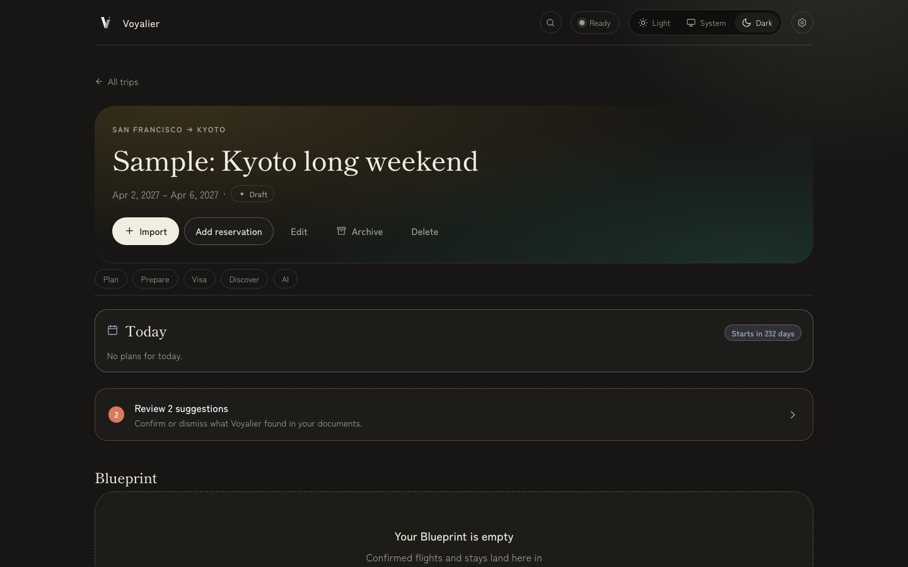
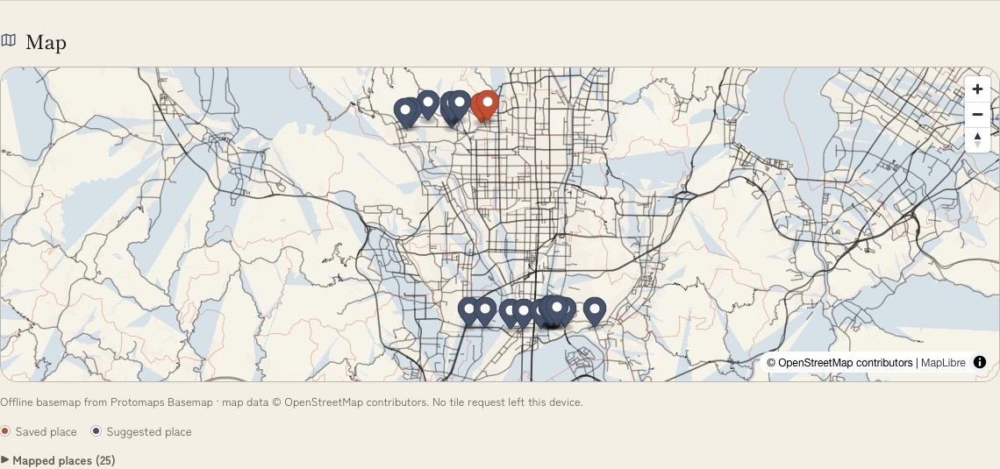
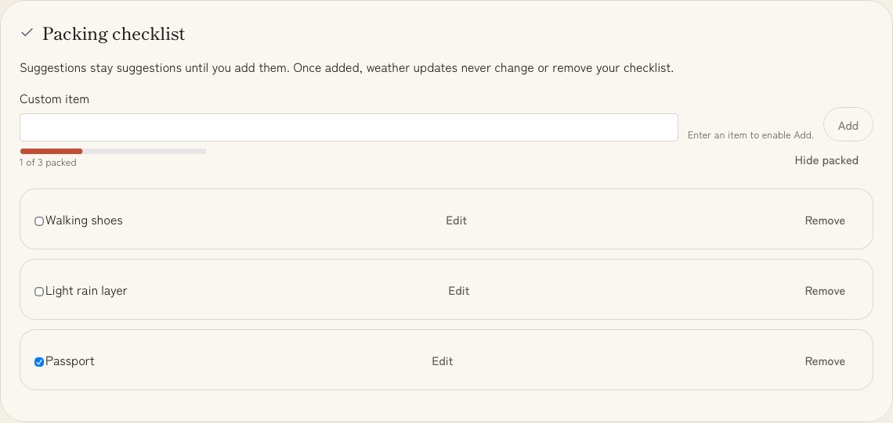
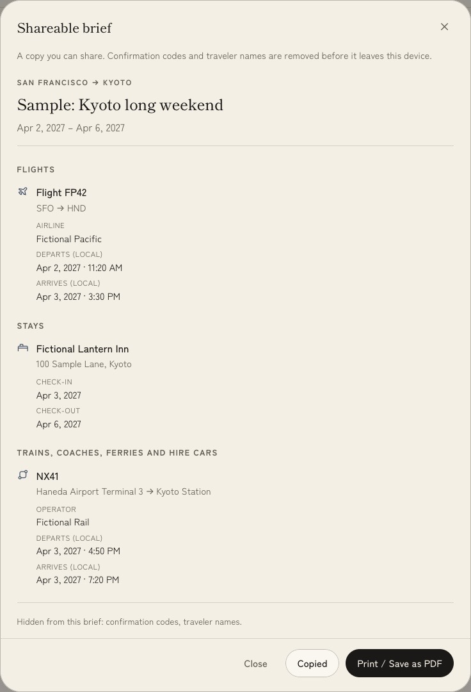
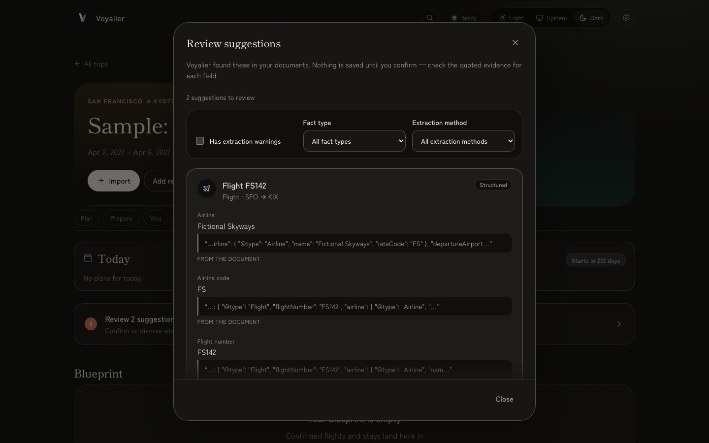
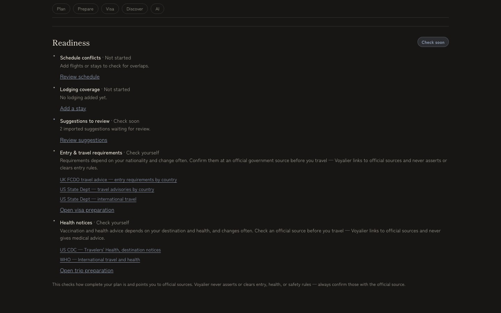
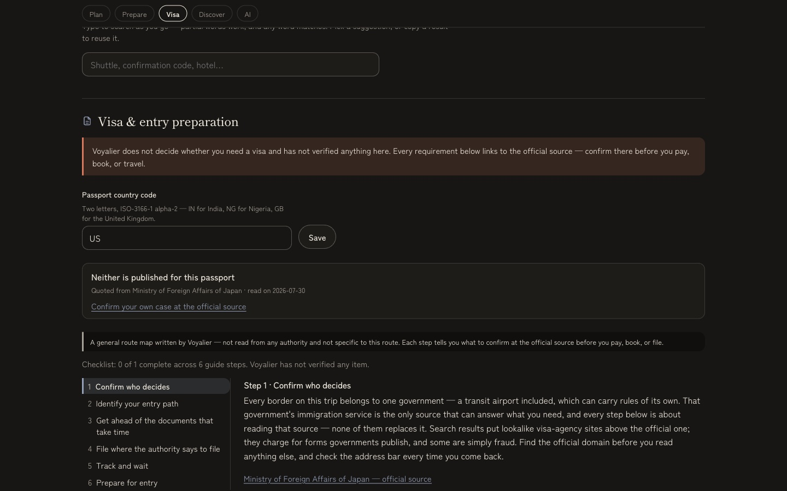
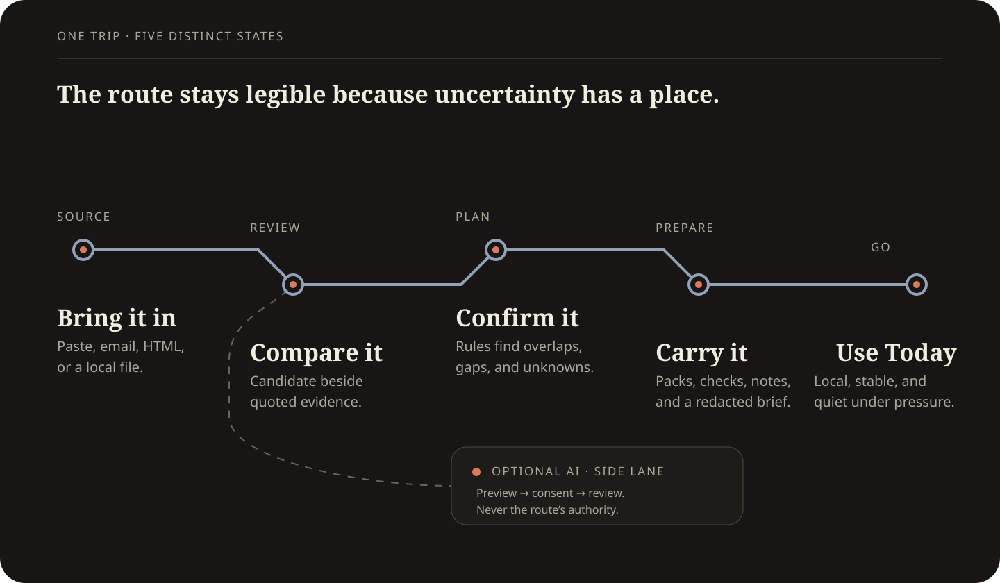

<p align="center">
  
</p>

<h1 align="center">Voyalier</h1>

<p align="center"><strong>Plan the trip. Keep the evidence.</strong></p>

<p align="center">
  A calm, local-first workspace for confirmations, research, readiness,<br>
  traveler-authored plans, and the details you need on travel day.
</p>

<p align="center">
  <strong>No account</strong>&nbsp;&nbsp;·&nbsp;&nbsp;<strong>No telemetry</strong>&nbsp;&nbsp;·&nbsp;&nbsp;<strong>No AI required</strong>
</p>

<p align="center">
  <a href="https://github.com/udhawan97/Voyalier/actions/workflows/ci.yml"></a>
  <a href="https://github.com/udhawan97/Voyalier/releases/latest"></a>
  
  
  <a href="LICENSE"></a>
  
</p>

<p align="center">
  <a href="https://udhawan97.github.io/Voyalier/"></a>
</p>

## Download

Choose your machine. The website resolves the current stable release into the
matching installer and keeps the GitHub Releases page as a fallback.

<p align="center">
  <a href="https://udhawan97.github.io/Voyalier/download/"></a>&nbsp;
  <a href="https://udhawan97.github.io/Voyalier/download/"></a>&nbsp;
  <a href="https://udhawan97.github.io/Voyalier/getting-started/"></a>
</p>

| Route           | Best for                                                | What you get                                                 |
| --------------- | ------------------------------------------------------- | ------------------------------------------------------------ |
| **macOS**       | Apple Silicon · macOS 13 or newer                       | Native `.dmg` desktop app                                    |
| **Windows**     | 64-bit Windows                                          | Standard `.exe`; `.msi` also published                       |
| **From source** | Supported Linux or Intel Mac; contributors and auditors | Same React interface through the guarded local browser stack |

> [!IMPORTANT]
> The desktop installers are public beta builds without paid platform publisher
> identity; macOS is not notarized and Windows may show SmartScreen. Updater
> artifacts are signed by Voyalier, and releases publish SHA-256 checksums. The
> [install guide](https://udhawan97.github.io/Voyalier/download/) explains the
> exact warning, optional checksum checks, and verified updater. The repository can
> be ahead of the latest published installer; the **stable** badge above is the
> source of truth for downloadable version.

<p align="center">
  
</p>

## What changed in 0.11.0

- The consent-opened map now puts saved places ahead of suggestions, gives each
  state its own marker and text label, and keeps the shortlist visible if
  recommendation loading fails or the source pack is later removed.
- Packing now shows honest progress from accepted checklist items only. You can
  hide completed rows locally without changing or deleting them; suggestions do
  not enter the count until you add them.
- The redacted brief now includes surface journeys and can be copied as readable
  plain text beside Print / Save as PDF. The copy formatter cannot name
  confirmation codes, traveler names, imported text, resources, or private plan
  notes, and clipboard denial is reported instead of being called success.
- Repeated row controls now identify the record they act on, while trip creation
  and searchable-record assembly each have one implementation rather than two
  drifting copies.

Read the [full changelog](CHANGELOG.md) for tradeoffs and intentionally unchanged
authority boundaries.

## The simple version

A trip usually arrives as scattered PDFs, email threads, research tabs, notes,
and half-made decisions. Voyalier gives that pile one shape without pretending
uncertain information is settled.

1. Create a trip.
2. Import a confirmation or add your own plan.
3. Review every suggested detail against its source.
4. Let deterministic rules find overlaps, gaps, and missing review.
5. Add connected context only when you ask, then keep the useful result locally.

Voyalier does **not** book travel, monitor a trip in the background, guarantee a
price or opening time, or issue authoritative visa, safety, or health decisions.

## What it does

The useful parts work without a paid model or provider key.

|                                                                    | Part of the trip             | What Voyalier does                                                                                                                                    |
| :----------------------------------------------------------------: | ---------------------------- | ----------------------------------------------------------------------------------------------------------------------------------------------------- |
|  | **Bring in evidence**        | Imports pasted text, HTML, raw email, or local files and keeps source excerpts attached to what it found.                                             |
|    | **Review before belief**     | Leaves extracted flights, stays, rail, coach, ferry, and hire-car details pending until you confirm, correct, or dismiss them.                        |
|      | **Plan and pressure-test**   | Builds a deterministic Blueprint, finds overlaps and lodging gaps, shows Today, and makes traveler-authored activities and transfers first-class.     |
|   | **Prepare for weak signal**  | Keeps research, destination facts, city packs, recommendations, saved places, packing, maps, and a redacted brief available from the local workspace. |
|   | **Protect the workspace**    | Stores one local SQLite workspace, seals sensitive evidence with a keychain-backed vault, supports backup and restore, and sends no telemetry.        |
|        | **Ask carefully, if useful** | Offers optional on-device Ollama and previewed BYOK cloud assistance. Remote content leaves only after explicit consent.                              |

<details>
<summary><strong>See the complete capability map</strong></summary>

| Area                    | Current source behavior                                                                                                                                                |
| ----------------------- | ---------------------------------------------------------------------------------------------------------------------------------------------------------------------- |
| **Trips**               | Create, edit, archive, restore, and delete trips; remember the active trip and section; build a deterministic Blueprint.                                               |
| **Confirmations**       | Import text, HTML, `.eml`, or local files; preserve parser runs, excerpts, field spans, and warnings.                                                                  |
| **Review**              | Filter locally by warning, fact type, or extraction method, then confirm, edit and confirm, dismiss, or undo one candidate at a time; nothing is promoted silently.    |
| **Itinerary**           | Order confirmed transport and stays; report literal overlaps, lodging gaps, handoff slack, and exposed connections without inventing predictions.                      |
| **Readiness**           | Explain logistics gaps, open the local context that can address each finding, and link to official entry/health sources without making authority claims.               |
| **Visa preparation**    | Keep passport-specific preparation, dated official sources, a universal guide, traveler ticks, and sealed notes clearly separated from a visa decision.                |
| **Live context**        | Fetch official advice, destination weather, page snapshots, packs, maps, or a manual trip re-check only after an explicit action. There is no background monitoring.   |
| **Offline discovery**   | Rank licensed city-pack places with visible scores and reasons; save places with provenance and map the saved shortlist separately from suggestions.                   |
| **Traveler plans**      | Keep packing items, activities, rail legs, and transfers separate from imported facts; track accepted packing progress and include safe plans in Today and exports.    |
| **Search and research** | Search local source documents, confirmed facts, notes, saved places, plans, and saved reading with trip/source provenance; nested detours return to their exact entry. |
| **AI assist**           | Guide local Ollama setup; validate BYOK cloud keys; preview the exact redacted payload; keep cloud help optional; keep trip chat on-device only.                       |
| **Vault and sharing**   | Seal sensitive columns at rest; optionally passphrase-wrap the key; print, save, or copy an allowlisted brief whose model excludes names and confirmation codes.       |
| **Language and access** | Complete English and Spanish catalogs, keyboard flows, focus containment and return, reduced motion, contrast checks, 320 px reflow, and automated axe gates.          |

</details>

## See the work

### The map keeps the traveler’s choice distinct

<p align="center">
  
</p>

The map opens only after consent. Saved coordinates already kept with the trip
lead the marker set, suggestions follow, and an expandable text register gives
the canvas a nonvisual equivalent. A marker is still a place on a shortlist—not
a claim about hours, price, availability, access, or safety.

### Packing progress counts decisions, not proposals

<p align="center">
  
</p>

Only items the traveler accepted or typed enter the denominator. Hide packed is
a reversible local view filter: it never edits the checklist or turns completion
into a readiness or safety claim.

### Sharing can be copied without widening the brief

<p align="center">
  
</p>

Flights, stays, surface journeys, and scheduled traveler-authored plans can be
printed, saved as PDF, or copied as plain text. The clipboard path receives the
same redacted projection and has its own safe-field allowlist.

### Evidence stays beside the decision

<p align="center">
  
</p>

The importer proposes. The traveler decides. A candidate keeps the excerpt that
supports it so a correction is grounded in the document, not a confident guess.
Local filters shorten a long queue without turning review into a bulk action.

### Readiness points to the next local step

<p align="center">
  
</p>

A logistics finding can take you to the exact confirmed fact, traveler-authored
plan, Stay form, or review queue it names. Entry and health remain link-only,
traveler-confirmed work; navigation never turns them into cleared requirements.

### Preparation says where its authority stops

<p align="center">
  
</p>

Visa and entry preparation points to the official source, records when it was
read, and says plainly what Voyalier has not verified. It organizes the work; it
does not decide the case.

### The route remains readable

<p align="center">
  
</p>

## Trust by design

- **Local is the default.** Trips, evidence, confirmed facts, notes, packs,
  provider settings, and activity metadata live on your machine.
- **Imports are untrusted.** Suggested details remain candidates until you
  confirm or correct them.
- **Connected features wait.** Advice, weather, page fetches, packs, maps, a
  trip re-check, and AI do not refresh quietly.
- **Remote AI is previewed.** You see the exact redacted payload before an
  OpenAI or Anthropic request leaves the device.
- **Sharing starts with exclusion.** Traveler names and confirmation codes never
  enter the brief output model.
- **There is no recovery theater.** If you passphrase-lock the vault and forget
  the passphrase, Voyalier cannot recover it.

<p align="center">
  
</p>

<details>
<summary><strong>What can use the network?</strong></summary>

| Connection                            | Explicit trigger                      | What leaves the device                                                                               |
| ------------------------------------- | ------------------------------------- | ---------------------------------------------------------------------------------------------------- |
| **GOV.UK FCDO**                       | Fetch official advice                 | Selected country slug                                                                                |
| **Open-Meteo**                        | Fetch weather                         | Destination for geocoding, then coordinates                                                          |
| **Government processing-time source** | Fetch published times                 | The route values needed by that authority’s public tool                                              |
| **GitHub Releases**                   | Download a pack, update, or installer | Public asset request; no trip content                                                                |
| **OpenFreeMap**                       | Show map                              | Map viewport tile requests                                                                           |
| **A saved page**                      | Fetch page details                    | Only the address you saved; the response is size-capped and reduced to readable text                 |
| **Ollama**                            | Run assist or send local chat         | Redacted trip material to localhost; chat also includes the question and retrieved local context     |
| **OpenAI / Anthropic**                | Run assist after preview              | Exactly the redacted payload shown in the consent step; the BYOK key is used only for authentication |

Official entry, health, and safety sources outrank commercial, editorial,
community, and model content. AI can help explain a trip; it cannot clear one.

</details>

## Four ways it can think

| Mode                          | Contract                                                                                                            |
| ----------------------------- | ------------------------------------------------------------------------------------------------------------------- |
| **Deterministic local rules** | Parsing, validation, itinerary checks, readiness, search, ranking, Today, and brief redaction. Always the baseline. |
| **Offline snapshots**         | Saved evidence, downloaded packs, and derived views. Old live information stays dated instead of aging into fact.   |
| **On-device AI**              | Optional Ollama on localhost. No cloud key and never required.                                                      |
| **Cloud AI**                  | BYOK OpenAI or Anthropic after an exact redacted-payload preview. Keys stay in the OS keychain.                     |

## Run from source

The browser source route is supported on compatible macOS and Linux development
hosts.

Requirements: Bash, Make, Node.js 24+, pnpm 11+, and a current stable Rust
toolchain with `rustfmt` and `clippy`. Node.js 24 requires macOS 13.5 or newer;
the [setup guide](https://udhawan97.github.io/Voyalier/getting-started/) links to
the complete Node and Rust platform lists.

```bash
git clone https://github.com/udhawan97/Voyalier.git
cd Voyalier
make bootstrap
make dev
```

Open `http://127.0.0.1:5173`. Vite proxies `/api` to the loopback-only Axum
service at `http://127.0.0.1:8787`. The desktop app uses the same React
interface through direct Tauri IPC and does not bind a TCP port in release mode.

<details>
<summary><strong>Useful contributor commands</strong></summary>

```bash
pnpm dev:web      # React interface only
pnpm dev:docs     # Astro/Starlight documentation
make check        # formatting, types, lint, Rust, desktop, integration, and browser gates
pnpm test:e2e     # Chromium journeys plus shared Chromium/WebKit regressions
```

Use `make check` as the repository gate. A bare `cargo test` skips the desktop
crate and is not equivalent.

</details>

## Architecture

<p align="center">
  
</p>

| Layer                    | Owns                                                                                                           |
| ------------------------ | -------------------------------------------------------------------------------------------------------------- |
| `crates/voyalier-core`   | Domain types, deterministic rules, validation, parsing, readiness, ranking, search, Today, and redaction—no IO |
| `crates/voyalier-app`    | `AppService`, SQLite, vault, backup/restore, network and keychain seams                                        |
| `crates/voyalier-server` | Thin loopback-only Axum adapter                                                                                |
| `apps/desktop/src-tauri` | Thin native Tauri adapter                                                                                      |
| `apps/web`               | Shared React product interface over the versioned `AppGateway`                                                 |
| `docs-site`              | Static product story and documentation; it does not host the local backend                                     |

Read the [architecture guide](https://udhawan97.github.io/Voyalier/architecture/)
or the repository’s [architecture decisions](docs/architecture/) before changing
contracts, transport, storage, or provider behavior.

## Product boundaries

Voyalier is a public beta. The current scope deliberately leaves out autonomous
booking, payments, inbox monitoring, shared accounts, hosted sync, background
trip monitoring, authoritative visa/safety/health decisions, and guaranteed
prices, availability, or opening hours.

That is not missing brochure copy. It is the trust boundary.

## Documentation and project

- [Product story](https://udhawan97.github.io/Voyalier/)
- [Download and install](https://udhawan97.github.io/Voyalier/download/)
- [Getting started](https://udhawan97.github.io/Voyalier/getting-started/)
- [Privacy and trust](https://udhawan97.github.io/Voyalier/privacy/)
- [Troubleshooting](https://udhawan97.github.io/Voyalier/troubleshooting/)
- [Roadmap](https://udhawan97.github.io/Voyalier/roadmap/)
- [Changelog](CHANGELOG.md)
- [Contributing](CONTRIBUTING.md)
- [Security policy](SECURITY.md)

Apache-2.0 licensed. Built in the open for trips that should remain yours.
