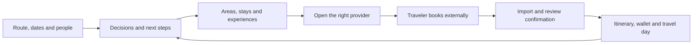

# Voyalier travel concierge cockpit plan

## Decision and handoff

Evolve Voyalier into a **personal travel concierge with a document wallet and a clear next action**. A traveler states where, when and who; Voyalier assembles the decisions, trusted resources, places, documents and booking handoffs into one coherent journey. Preserve the warm paper/charcoal, indigo and vermilion identity. Add geographic depth, tactile detail and purposeful motion around a calmer, task-oriented interface.

The product name in source and brand assets is **Voyalier**. Keep it; “Walletier” is useful as a description of the desired concierge role, not a rename instruction.

**Status: implementation and v0.12.0 release work authorized September 12, 2026.** Baseline is `d43a863ed39013129f402e95efef42f7b467a273` (`0.11.1`). The plan was committed before code. It does not authorize purchasing travel, submitting visa applications, subscribing to providers, changing production data, or scraping sources without compatible rights.

The implemented and deliberately deferred portions of this roadmap are tracked
in the [v0.12.0 verification ledger](../../release/v0.12.0-verification.md).

Read these companion artifacts before implementation:

- [Current-product audit and the Hawaii/Montréal walkthroughs](../../research/2026-09-12-concierge-journeys-and-product-audit.md).
- [Provider feasibility, concrete links, source rights and six GitHub inspirations](../../research/2026-09-12-concierge-providers-and-inspiration.md).

The detailed evidence and limitations live there. No universal best-provider ranking, dated accommodation availability, actual immigration eligibility, or future weather has been established. Recommendations below are product/design decisions informed by those sources.

## 1. What the new experience promises

“Tell Voyalier your trip once. Know what to decide, what to prepare, where to look, and what to bring.”

The useful concierge loop is:

Three behaviors define the improvement:

1. **Do the organizing.** Resolve the destination, gather a bounded set of permitted sources, surface three useful choices, keep the user's decisions and show the next unresolved task. Avoid asking the traveler to discover which of thirty panels they should use.
2. **Make outside websites part of the journey.** Open the correct destination/search/property/operator/government page, show which fields carried over, preserve context on return, and offer confirmation import. Payment and official applications stay on those websites.
3. **Carry the trip.** Store actual approved documents securely, connect them to people and tasks, make an honest offline kit and put the relevant document/transfer on the travel-day screen.

“Travel anywhere” means a worldwide route can be represented and the app explicitly reports its coverage. It does not mean every country has a maintained visa guide, every city has licensed review data, or every road has offline routing. Show `Complete local pack`, `Some sources`, or `Links only` with a next action, never fabricated coverage.

## 2. Preserve, deepen and add

| Preserve/reuse                           | Deepen                                                | Add                                                                       |
| ---------------------------------------- | ----------------------------------------------------- | ------------------------------------------------------------------------- |
| Trip CRUD and validated date handling    | Guided trip context and destination resolution        | Multi-person party and reusable local traveler profiles                   |
| Today, Journey Board, Blueprint          | Compact cockpit and day/segment navigation            | Prioritized next-action projection                                        |
| Imports, approval, amendment and restore | Booking handoff → confirmation continuity             | Actual encrypted PDF/image attachments and wallet                         |
| Visa preparation and official links      | Conditional per-person workflow and portal steps      | Residence/mode/transit/return context and evidence-linked tasks           |
| City packs, MapLibre and offline maps    | Area comparison and itinerary-aware discovery         | Montréal pack, area/segment model and permitted source adapters           |
| Saved reading and local search           | Shortlists, provider actions and task-linked research | Provider capability/rights registry and structured search intent          |
| Food/culture/nature interests            | Pace, access, diet and accommodation constraints      | Transparent preference-fit filtering and comparison                       |
| FX, practical facts, tipping, weather    | Everyday destination brief                            | Budget ledger, cost comparison and cancellation tasks                     |
| Settings, vault, backup, sources         | Clear categories and controls                         | Motion/data-use/provider-default and offline-kit controls                 |
| Brief/calendar export                    | Selected-person/document-aware sharing                | Deliberate attachment export with preview, separately from redacted brief |

Do not relabel already-shipped features as new. The source audit identifies their current files. Do not add another map renderer, generalized agent framework, cloud backend, crawler farm or vector database to get the first useful version out.

## 3. Information architecture

### Global shell

Desktop: a quiet 208–224 px left rail, a compact global top strip, and a generous working area. Rail contains Trips, Search, Wallet and Settings. Inside a trip it switches to Overview, Explore, Plan, Documents and Prepare; Money is a subsection reached from Overview/Plan, and Ask is a contextual drawer. Global navigation remains reachable without a trip. These are proposed components, not a new router/framework dependency.

At narrow widths, use a simple trip header and five labeled bottom destinations or a compact navigation menu after testing available width. At 200% zoom, fall back to the narrow layout instead of shrinking text or trapping content in two dimensions. Documents and Prepare must stay within two navigation actions from any trip view.

Keep current `?trip=` identity, browser back/forward behavior, search-result record IDs and section anchors. Add view state in a backwards-compatible query value. Old `#section-visa`, `#section-prepare` and exact-record links resolve to the appropriate view and row with focus. Do not reset local edits when switching views. Escape closes the topmost drawer/dialog and returns focus to its actual opener.

### Screen specifications

| Screen     | First viewport                                                                            | Primary action                       | Secondary/detail                                              |
| ---------- | ----------------------------------------------------------------------------------------- | ------------------------------------ | ------------------------------------------------------------- |
| Trips      | Upcoming journey, next decision, compact trip list; first-run route form                  | Continue trip / Plan a trip          | Archived journeys and optional visited map                    |
| New trip   | From/to/dates, flexible-date option, party count; optional title                          | Build my trip                        | Island/area disambiguation and a short preference step        |
| Overview   | Route scene, local dates/people, three next actions, chosen area, compact travel timeline | Resolve highest-priority task        | Readiness split, cost estimate, offline kit, sources          |
| Explore    | Map + editorial shortlist; Stays/Food/Things to do/Transport switch                       | Compare areas / View provider        | Source-native ratings, “why this fits”, research sources      |
| Plan       | Day/segment rail, timeline, confirmed evidence versus authored plans                      | Add a plan / Resolve missing stay    | Full Board, history, conflicts and cancellation tasks         |
| Documents  | People tabs, document groups, missing-file tasks and quick access                         | Add documents                        | Import review, expiration, original/derived files, export     |
| Prepare    | Separate person cards and dependency-based task list                                      | Open next official step              | Source date, portal guide, documents, receipts, return branch |
| Money      | Whole-party planned/committed/paid amounts with currency labels                           | Add estimate / Record cost           | Per-person split, refunds, cash plan, FX source date          |
| Travel day | Today's ticket, stay address, next transfer, one useful map, urgent user deadlines        | Open relevant document               | Operator contacts, emergency resources, offline status        |
| Settings   | Travel defaults, appearance, data/privacy and application categories                      | Search settings / change one control | AI configuration, sources, backup, updates and diagnostics    |

### Overview composition

At a 1440 px design reference, reserve approximately 216 px for navigation and 32 px content margins. Use a 7:5 upper composition: route/destination scene on the left, “Next for this trip” on the right. Under it, show a slim departure → stay segment → return timeline. The third band contains the current area/shortlist and documents/offline summary. Do not force identical card heights or a three-card grid onto unrelated content.

At 1024 px, reduce the rail to compact labeled navigation and let the map sit below next actions. Below roughly 760 px, one column puts route summary → next action → today's/next travel → documents before decorative geography. Exact breakpoints are validated against actual content, not devices alone.

Example first-screen copy for the Hawaii scenario:

> Chicago → Hawaiʻi · Nov 30–Dec 14 · 4 travelers  
> **First, choose your island.** Compare the pace, places and transfers.  
> Next: choose your base · confirm room/bed setup · check return-date meaning

After those decisions, replace the next action with “Compare stays in your chosen area.” Once bookings exist, replace it with the next unresolved preparation task. Do not permanently pin setup tasks after completion.

## 4. Visual and interaction direction

### Chosen aesthetic: a tactile travel atlas

Preserve the current palette, logo and two existing font families. Give the product stronger spatial hierarchy and richer destination character. The signature scene is a restrained relief map with a thin indigo route and a vermilion destination marker; documents resemble carefully stacked paper objects without obscuring their labels. The visual identity should survive with images, animation and WebGL switched off.

Use existing `--voy-*` semantic tokens in `packages/ui/src/tokens.css`; do not introduce a second system copied from `docs-site/design.md` or root marketing `tokens.css`. Refine current tokens in place. If OKLCH values are adopted, convert the existing hues with visual comparison rather than using conversion as a palette redesign.

| Element     | Direction                                                                                               | Limits/acceptance                                                                                                                                           |
| ----------- | ------------------------------------------------------------------------------------------------------- | ----------------------------------------------------------------------------------------------------------------------------------------------------------- |
| Color       | Warm paper in light, warm charcoal in dark; indigo for route/selection, vermilion for important actions | Status always includes text/icon. Check every on-accent pair in both themes.                                                                                |
| Type        | Existing serif for trip/place headings; existing sans for controls and long reading                     | Raise primary reading text toward 16 px; no essential instruction at tiny caption size. Limit display hierarchy, preserve font fallback and glyph coverage. |
| Surfaces    | Matte panels, fine keylines, shallow shadows and slight elevation around a selected object              | Keep body text on solid readable surfaces; no full-screen frosted glass.                                                                                    |
| Texture     | Locally bundled, very subtle paper grain on large background areas; contour lines near geography        | Static, low opacity, no texture under dense document text; no remote asset request on launch.                                                               |
| Photography | One licensed image per destination/area where useful, with a meaningful crop and recorded credit        | Never reuse provider listing photographs without rights; blank/static map fallback first.                                                                   |
| Icons       | Existing family, refined for document/entry/stay/transport consistency                                  | Labels for important actions; decorative icons hidden from assistive tech.                                                                                  |
| Documents   | Shallow stack with category, owner, expiry and offline state; reveal as a flat readable viewer          | Never render passport numbers, barcodes or original scan thumbnails on the home cover.                                                                      |
| Map         | Selected-day pins, area outlines, optional route/terrain/buildings                                      | Selection syncs with an equivalent list; estimated lines are explicitly not directions.                                                                     |

### 3D with a job to do

MapLibre already ships. Its official examples demonstrate terrain, building/model layers and globe-related rendering; these are capability references, not proof that Voyalier's installed engine/data supports the intended effect. [MapLibre 3D terrain](https://maplibre.org/maplibre-gl-js/docs/examples/3d-terrain/).

Implement the visual progression in this order:

1. **Static atlas:** shaded contour illustration, route arc, destination pin, paper depth. Works offline without a GPU.
2. **Interactive map:** existing MapLibre with selected-day filtering, area boundaries and linked list. Consent remains explicit for online tiles.
3. **Optional relief:** terrain and restrained buildings only where elevation/building data are licensed, present and tested. Display a 2D/3D switch, reset view and an honest coverage state. Terrain data has its own download and attribution requirements; a PMTiles basemap does not imply terrain coverage.
4. **Optional opening moment:** a brief route reveal the first time a trip is opened or its destination changes, never an obligatory full-screen flight animation. Stop on interaction; no continuous spinning globe.

Do not add Three.js until a bounded experiment proves an interaction needs it beyond MapLibre/CSS and records bundle, battery, license and fallback costs. The first concierge milestone must not depend on that experiment.

### Motion grammar and full states

Use at most three recurring primitives: a short opacity/position entrance for changed panels, an understated selection/elevation response, and one optional route reveal. Standard controls keep roughly the existing 150–250 ms timings. Route reveal can use up to 600 ms after explicit context change. Animate transform/opacity for ordinary UI; continuous map movement is user-driven and stops when hidden.

Honor OS reduced motion plus an in-app `System / Reduced / Full` preference; explicit Reduced always wins. Reduced mode uses static geography and a brief opacity change, with no parallax, camera flight or animated document flip. Focus appears immediately. Do not couple animation completion to data availability, saving or navigation.

Every interactive component specifies default, hover, focus, active, disabled, loading, error and success states. Also cover empty, offline, stale, unavailable, permission not given and partially completed tasks. Loading must not falsely imply a provider query ran when it is disabled. A save can use a quiet inline success and Undo; passport/application changes need explicit context, not celebration.

### Visual acceptance targets

These are proposed targets to measure, not results already achieved:

- No horizontal page scroll at 200% zoom; no loss at 320 CSS px reflow where applicable. Map itself may pan, but surrounding controls and list must reflow.
- WCAG 2.2 AA contrast, keyboard order, visible focus, accessible names and screen-reader announcements across light/dark/reduced motion. Use non-drag alternatives for every itinerary movement.
- Ordinary controls respond within 100 ms of local interaction on the recorded reference machine; no decorative work that blocks opening documents or typing.
- No new initial-load 3D dependency; keep visual-shell addition within a provisional 50 KB gzip budget before destination assets. Record current build sizes first and justify any change.
- Destination artwork under a provisional 250 KB per default view; lazily load it and stop offscreen animation. Record licensing and include a no-image state.
- Test WebGL unavailable/context lost, offline tiles missing, long names, four-plus people, a fourteen-night stay, and 100 documents without an unusable page.
- Conduct a small observed usability pass: can a new user find the next action in 10 seconds, launch a suitable stay search in 3 meaningful actions after setup, and open the day's document in 2? Treat these as hypotheses to test, not marketing claims.

## 5. Context and next-action engine

### Ask once, progressively

Required to create an existing-style trip: from, to and date window. A new `TripIntentDraft` can persist locally with undecided dates or island before producing the current validated `Trip`; do not weaken `CreateTripInput` or fabricate dates just to save an idea.

Collect optional context in short steps:

- **People:** count first; adults/children/age band only when needed, readable aliases and independent profiles. Never assume four travelers means four adults.
- **Stay:** rooms/bedrooms/beds, kitchen, laundry, air-conditioning, accessibility, area and cancellation preference. Separate bedrooms from beds and rooms.
- **Trip style:** food/culture/nature weights already exist; add pace, car willingness, activity effort and free-time preference. Hard constraints filter before interest weighting.
- **Money:** budget range and base currency, whole-party versus per-person meaning. No invented “comfortable budget.”
- **Entry preparation:** selected travel document country/type, citizenship when distinct, residence/status, destination/transit countries, purpose and travel mode. Explain why each field changes guidance. Optional until relevant; keep unknown as unknown.

Reusable profiles live locally and must be deliberately attached to a trip. Never infer one person's documents from another person or silently apply the last passport choice to everyone. Ask whether a proposed change applies to this trip or future defaults; preserve a trip-specific snapshot/history.

### Task projection

Add a deterministic projection, reusing readiness/planning inputs, rather than an LLM that invents obligations. Rank by explicit deadline first, then blocking dependencies, then known trip date, then preference. Only report a dependency the source/traveler actually supplied.

Task fields: stable ID, trip/person/segment scope, category, user-visible title, state, reason, prerequisite IDs, due date plus timezone/origin, source reference, linked document IDs, next action and explicit authority class. Proposed states: `not_started`, `in_progress`, `waiting`, `done_by_traveler`, `not_applicable`, `needs_recheck`. Store only user decisions and events; derive next-action ordering from current evidence.

Keep logistics completeness, user preparation progress and external authority status separate. A completed checklist means “You marked 8 steps done,” never “Visa approved” or “Safe to travel.” Importing an authority letter may support a user-reviewed record, but Voyalier still does not guarantee admission.

A route, date, person, passport or residence change invalidates dependent recommendations and guidance. Preserve existing notes/history; show what must be reviewed. Never retain a green status solely because the previous destination used the same step label. Unknown deadlines remain undated; do not synthesize consulate/biometrics times.

## 6. Discover, compare, book elsewhere and return

### Provider selection

Default to two or three useful starting points per intent, with a reason:

- Whole-home/kitchen searches: Airbnb and a relevant alternative such as Vrbo when a verified entry link exists.
- Hotels/service/room comparisons: Expedia, Booking.com and optionally Trivago; include direct-property website for a saved candidate.
- Flights: Google Flights route entry pages or Expedia Flights, researched in the provider companion, plus the recorded/selected airline's official site. No invented flight times, fares or “cheapest” badge.
- Food: place discovery plus Yelp where rights/access permit; business website for menus/reservation; community discussions as a separate anecdotal layer.
- Hikes: permitted open route data and official park pages for permits/closures; AllTrails as an external community resource.
- Transport: official operator pages and documented navigation handoffs. One island's transit feed cannot cover the whole state.

“Recommended provider” means an editorial fit to the requested task, not that the provider is universally highest-rated by consumers. Native review scores should appear with platform, scale, count, age and scope only when licensed. Do not average incompatible scores or treat Reddit votes as verified visits. Personalized fit remains independent of restricted provider-rating analysis.

### Search-intent contract

Keep a structured `SearchIntent`: category, destination/area ID, public place name, optional coordinates, origin airport(s), segment, local check-in/out dates, date flexibility, party composition, rooms/bed requirements, currency and selected preferences. Only transmit the minimal provider-relevant subset. Never include passport/status, document text, booking references or home address in a search URL.

Each provider action returns:

- URL and canonical provider domain;
- label and destination context;
- `documented_api_returned`, `documented_template`, `observed_search_template`, or `observed_destination_link` verification class;
- fields transferred and fields still to enter;
- evidence URL, verified date, fallback URL and capability/disabled reason;
- minimal disclosure of the external request, with no prefetch until the user acts.

A verified provider-returned URL is preferred. A manually observed public search template may be enabled only after its destination/dates/party/filters are visibly verified in the target browser and pinned in fixtures; it remains a brittle adapter with a kill switch. A destination page alone must say “Explore stays,” not “Matching available rooms.” No guessed Expedia destination IDs, Airbnb amenity tags, unsupported query blobs or affiliate parameters.

Concrete initial links are in the provider companion: Airbnb Hawaii/Oʻahu/Honolulu/Montréal and Expedia Honolulu/Montréal. They were found on first-party indexed pages; exact date/guest preservation was **not** verified. The first useful delivery therefore includes **Copy search details** and a clear “Enter dates and filters on provider” line. This fulfills the concierge handoff without depending on inaccessible partner APIs. Sol should perform one bounded public-UI link-validation spike; if supported search state can be observed, upgrade that adapter rather than promising it in advance.

### Returning from a provider

Persist a local handoff record before opening the default browser. On return, show the original shortlist and three actions: Save a candidate, Compare another, Import confirmation. Do not inspect the user's provider account or infer booking completion from browser focus or URL changes. The web experience uses ordinary external navigation; the Tauri path uses the established safe external-opening boundary, not a nested checkout webview.

Suggested → Saved → User says booked → Reviewed confirmation are distinct states. Only reviewed confirmation uses the existing evidence lane. A screenshot of a listing is not proof of a reservation. Amendments/cancellations preserve history and re-project costs, tasks and calendar lineage deliberately.

### Permitted acquisition, including scraping

Implement a provider policy registry **before** adding new acquisition:

| Acquisition class             | Use                                                     | Required controls                                                                                                 |
| ----------------------------- | ------------------------------------------------------- | ----------------------------------------------------------------------------------------------------------------- |
| Official/open structured data | Destination facts, park alerts, permitted place data    | License, provenance, attribution, timestamp, scope and rate limits                                                |
| Approved partner API          | Inventory/native ratings/redirects                      | Actual approved access, endpoint/field allowlist, credentials, quota and retention/display/analysis rights        |
| Allowed public-page parser    | Bounded readable official/local content where permitted | Per-domain terms/access review, size/time limits, parser fixtures, content hash, source date, clear failure state |
| Link only                     | Provider blocks extraction or rights unverified         | Useful destination page, copyable search intent, user notes and return/import workflow                            |

The requested scrapers become controlled adapters, not a browser bot that bypasses login/CAPTCHA/rate limits. Public readability and robots permission do not grant reuse rights. API access cannot be replaced with undocumented endpoints. Scraped/model text is untrusted and cannot issue tool calls or determine visa, medical or safety outcomes.

Keep network through `AdviceFetcher`; extend the existing seam as needed, reusing `FakeFetcher` and offline fixtures. The existing saved-reading fetch must consult provider policy too: a user-pasted Airbnb/Yelp/AllTrails URL must not bypass the registry through a generic snapshot function. `Unknown` rights default to link-only until reviewed, while original user notes remain usable. Design migration treatment for any existing restricted snapshots explicitly; do not silently delete user data.

Rights apply through search indexes, caches, AI context, backups and offline exports. A source can be displayable while not permitted for AI summarization or long-term storage. Current Yelp constraints are recorded in the companion and make indefinite offline review packs unsuitable. Expedia Redirect onboarding is presently paused; Booking.com requires partnership; these are activation blockers, not coding tasks that Sol can assume away.

Use a bounded explicit “Research this trip” action: preview the providers/data sent, show per-source progress, allow cancellation, retain partial success, and report `no results`, `unavailable`, `not permitted`, `rate limited` and `failed` distinctly. Do not silently enable background monitoring. Reuse the current explicit recheck model; reminders/monitoring require a later product decision.

## 7. Entry and visa preparation

The central enhancement is a **per-person, per-leg preparation workflow**. Current nationality-only routing is insufficient for the mixed-party example. Follow ADR-0006's authority boundary: the app helps select and execute sourced steps; it does not approve entry or derive universal eligibility from incomplete attributes.

Show a compact person selector with `Needs context`, `Steps available`, `Waiting for authority`, or `You marked prepared`. Each person gets destination entry, transit and return-home sections. A domestic U.S. itinerary opens ID/agricultural/transport preparation; a foreign connection triggers an explicit review of international legs. U.S. nationality and U.S. citizenship are distinct until confirmed.

### Step cards

Every card answers six questions:

1. What does the authority call this step, and what does it mean?
2. Does it apply to the selected pathway, or must the traveler confirm applicability?
3. Which exact authority/authorized-provider page opens next?
4. What documents from **this person's** wallet are relevant, and which are missing?
5. What comes before/after it; is a deadline from an actual letter or just unknown?
6. What evidence did the traveler save and when should the source be rechecked?

A document checklist displays `portal required`, `authority says conditional`, or `traveler added`; it never invents an exact required-document count. After the official portal gives a personalized list, the app can show “3 of 7 linked” because those seven items were actually recorded, not because every traveler needs seven.

### Portals and application order

Maintain a versioned `PreparationRoute` with jurisdiction, purpose, travel mode, applicability questions, authority URLs, source dates, conditional steps, dependent tasks and supported languages. Keep authentication, payment, personal form submission and appointment booking in the official browser flow. Use official entry pages that select the correct channel; do not hardcode a generic IRCC account link as suitable for all applications.

Guide templates are text-first with an optional annotated diagram of the process. Official portal screenshots are captured only where rights permit and are date/version labeled; never include a real application or passport. Include a no-screenshot guide so a portal redesign cannot make preparation unusable. Forms, fees, processing statistics and appointments link to current authority details; no guaranteed completion date.

The Canada example explicitly separates submission, biometrics instruction, authorized collection, additional requests, decision, passport submission/return and travel. It does not require a consulate visit for everyone. The research companion supplies the official sources and conditional branches, including U.S. permanent-resident treatment and a separate H-1B return review.

### Booking dependencies

Represent itinerary evidence, refundable holds and non-refundable purchases separately. Offer research before approval; attach cancellation terms and deadlines to any early commitment. Where the authority requires proof of a plan, link exactly what it asks for. Recommend delaying non-refundable spend while required travel documents remain unresolved, labeled as a conservative planning recommendation rather than a universal legal rule. Never generate fake booking proof.

Preparation changes need an ADR amendment/proposal before code. Preserve old visa progress by migration or explicit legacy attribution; never assign a trip-level passport/checklist to all new people. If the owner of existing progress is unknown, leave it as an unassigned legacy checklist until the traveler selects a person.

## 8. A real document wallet

### Scope

Support actual PDF, JPEG and PNG files first: passports/IDs, visas, instruction letters, appointment receipts, flight/stay/tour confirmations, insurance and other traveler-selected documents. Other formats stay unsupported with a clear explanation. Existing text/email import remains intact and separate from attachment custody. Local OCR is an optional later extraction step, not a prerequisite for storing a file.

Group by person, trip, category and linked task. Display title, document type, linked owner, user-entered expiry, locally available state and last reviewed date. Search metadata by default. Full sensitive text search must be explicit and covered by encrypted-storage/index rules; do not leak extracted passport text into the public research index.

### Storage decision to prototype

Prefer encrypted SQLite BLOB storage initially to preserve the single-file workspace and existing backup boundary. Add attachment data and metadata through `Records` and the single encryption declaration, extending its typed binary path if necessary. This is a proposed design requiring a bounded feasibility check, not permission to bypass `Records` or add an ad-hoc file vault. No silent plaintext fallback for new identity-file custody; if secure storage is unavailable, explain and refuse that import while preserving other app use.

Final limits: 20 MiB per file, 100 attachments per trip and 500 MiB of raw attachments across the workspace. The workspace limit is authoritative rather than a soft warning because base64 transport plus sealed-storage expansion otherwise lets permitted attachments exceed the 2 GiB portable-backup container. The UI preflights the known trip subtotal and the app service enforces the workspace total. Shared HTTP/Tauri transfer has equivalent per-file caps; the HTTP route bounds the encoded request and Tauri relies on UI preflight plus authoritative service validation. A later native streamed-file contract remains appropriate if measured use shows this bound is insufficient.

Validate MIME signature as well as extension, bound PDF page/image dimensions and parsing work, and disallow executable/HTML/script-bearing attachment execution. A PDF viewer must disable active content, remote resource loads and automatic external links. Originals stay unchanged; OCR, thumbnails and redacted derivatives carry parent/hash links and are encrypted too. Use explicit open/export actions with a clear destination; never leave decrypted temporary files unmanaged after lock/close/crash. Revoke object URLs and purge decoded viewer state on lock.

### Workflow and privacy

Drag/drop or choose file → local validation → classify/link person/task → optional local extraction preview → review → save. Document OCR must never mark a visa approved or replace a passport field without review. Duplicate content shows a reuse/link choice; deleting a task must not delete the shared document. Deleting an attachment explains affected references and offers reversible trash where practical.

Separate the default redacted travel brief from **selected-document export**. The brief must continue excluding names/codes/private notes and identity files. Attachment export requires a file list and content preview; do not say every export is redacted. Encrypted backup includes the new attachment format only after round-trip/tamper/size tests and compatibility are updated. Lock/unlock, lost-key behavior and backup recovery must be documented before calling this a passport wallet.

## 9. Destination, money and practical guidance

### Explore and local knowledge

Before listing businesses, help choose an area. Area cards show character, approximate location, transport approach, nearby interests, tradeoffs and source links. Do not use neighborhood safety scores or infer “locals love it” from scraped chatter. Candidate lists default to a small, explainable set, with an explicit “See more” and saved filters.

A food/place card contains original editorial context, fit reasons, any allowed native ratings, source/date and a canonical link. Opening hours, prices and access conditions are unknown unless the source supplies current data. When data disagree, show source-specific values or “Check on provider”; avoid a synthesized certainty score.

For hikes, store distance/elevation/difficulty only from named permitted sources, and keep trail condition, access permit, closure and weather separate. Add user-owned effort/access constraints. A source's “easy” rating is not medical suitability. Offer a lower-effort alternative without automatically changing the itinerary.

### Money

Add a simple local ledger. Distinguish estimates, quotes, committed costs, paid amounts, refunds and unknown fees. A currency amount stores exact decimal/minor units plus ISO currency, source, captured date, inclusion flags and optional exchange-rate snapshot. Never add unlike currencies without an explicit conversion date/rate and label; bank/card charges are not the ECB reference rate already shown.

Calculate whole-trip and per-person estimates from entered amounts. Keep fixed group costs (accommodation/car) separate from per-person costs (tickets/meals), and distinguish room-night from person-night. Changing party size invalidates assumptions instead of dividing everything blindly. Show exclusions such as tax, resort/cleaning/parking/baggage fees and refundable deposits. Refund received differs from refund requested.

A cash/credit/tipping checklist links local resources and lets users store a plan. Do not prescribe a universal visa bank-balance minimum, current FX rate, travel insurance coverage or affordability decision. Avoid storing card numbers or bank balances; the feature is a trip estimate ledger, not a banking integration.

### Practical kit

Surface the existing plugs/currency/tipping/clocks/weather/holidays where relevant, plus curated source links for airport access, connectivity/eSIM, accessibility, dietary needs, etiquette/language, emergency assistance and official health information. Operator/consular contact data need provenance and recheck dates. Do not invent emergency numbers or claim insurance will cover a condition. Offline copies obey each source's rights and freshness rules.

## 10. Settings, onboarding and guides

| Group             | Controls and guide                                                                                                                          |
| ----------------- | ------------------------------------------------------------------------------------------------------------------------------------------- |
| Travel defaults   | Home city without street address, currency/units, language, pace, interests, preferred providers; clear trip overrides                      |
| People & wallet   | Local profiles, consent to reuse a profile, document-linking guide, lock/auto-lock and recovery explanation                                 |
| Appearance        | System/light/dark; System/reduced/full motion; optional destination imagery/3D; comfortable/compact density with accessible defaults        |
| Online sources    | Per-provider on/off, what is sent, why, license, cache age, manual refresh and clear downloaded content                                     |
| AI                | Optional, grouped after core preferences; on-device chat separate from cloud one-shot preview/consent; no key input duplicated across trips |
| Offline & storage | Pack/attachment sizes, actual downloaded versus available state, partial-download recovery, disk warning, offline test checklist            |
| Application       | Existing updates/locale/backup/diagnostics; retain ADR-0022's closed updater settings schema                                                |

Do not reuse updater's key-value boundary for arbitrary new settings. Use typed feature-specific settings with defaults, validation, export/privacy treatment and tests for unknown keys. Keep relevant settings available when the vault is locked, without revealing private profile data.

Ship short in-app guides, mirrored in `docs-site` using its existing route conventions:

1. Plan a trip in five minutes: route → people → area → first provider → return.
2. Choose an island or neighborhood; compare dates, travel time and extra stay changes.
3. Find and book a stay: which filters transfer, compare totals/cancellation, import confirmation.
4. Prepare travel documents: per-person official steps, biometrics/appointments, conditional forms and return travel.
5. Understand evidence: suggestion, saved place, user-reported booking and reviewed confirmation.
6. Build an offline kit; what expires, what cannot be saved, what still works without a network.
7. Protect and recover the wallet; original versus redacted export and forgotten-passphrase consequences.
8. Use AI intentionally; what leaves the device and what AI cannot verify.

Use short demonstrations with synthetic data; no forced product tour on every launch. First run works without AI keys, cloud login, a pack download or a payment card. Add contextual help exactly at an unfamiliar action, plus a searchable guide index.

## 11. Architecture and proposed contracts

All new names below are design proposals. Final types, limits, error codes and wire payloads must be written in an ADR and implemented together across consumers; do not add placeholder methods to the live gateway just to reserve names.

| Module / ownership            | Responsibility                                                                     | Reuse / change points                                                                       |
| ----------------------------- | ---------------------------------------------------------------------------------- | ------------------------------------------------------------------------------------------- |
| Core `trip_context`           | Validate intent, party/segment links and constraints                               | Existing `types.rs`, `planning.rs`, `geo.rs`, date validation; no IO                        |
| Core `concierge`              | Derive next actions from evidence, tasks and user selections                       | `readiness.rs`, `journey_board.rs`, `contingency.rs`; no hidden changes to authority rollup |
| Core `provider_actions`       | Validate search intent, build allowed public URLs and explain transferred fields   | `resource.rs`, source registry; pure functions                                              |
| Core preparation extension    | Versioned questions/steps, applicability unknowns, per-person progress scope       | `visa.rs`, `visa_stats.rs`, ADR-0006; authority stays external                              |
| Core attachment/expense types | Validation and deterministic totals/link rules                                     | Existing errors, export/redaction types; no reading files or SQLite                         |
| App services                  | Persistence, encryption, attachment IO, licensed acquisition and cache enforcement | `AppService`, `Records`, append-only `MIGRATIONS`, `AdviceFetcher`, `SecretStore`           |
| Thin transport adapters       | HTTP/Tauri serialization and error parity                                          | Server handlers, desktop commands, gateway implementations, shared wire fixtures            |
| Web                           | Task navigation, map/list, wallet, preparation and provider-return interactions    | Existing view modules and `AppGateway`; no direct provider SDK secret handling              |
| Packs/publishing              | Montréal and later areas/data; attribution and offline assets                      | Existing catalog/build pipeline; publication is a separate authorized step                  |

Candidate gateway groups: trip context read/update; person list/create/update/link; task/progress read/update; search actions and handoff state; attachment import/list/read/export/trash; cost read/update; provider research/refresh and typed preferences. Minimize method count by grouping coherent operations, not by a universal untyped “execute action” method. Preserve `AppService` as the common façade.

Every new gateway method lands in `AppService`, Axum, Tauri, `contracts/src/index.ts`, `contracts/src/mock.ts`, `gateway/http.ts`, `gateway/tauri.ts`, and hand-maintained `parity/routes.json`; schemas and errors follow the contract. Extend selected whole-input shared wire fixtures for nested people, task evidence, money and bounded attachment payloads. No new public re-exports solely to reach intentionally private core internals.

New profile, document, task notes and sensitive metadata go through `SEALED_COLUMNS` plus read/write paths. Define expiry handling for non-user-owned provider cache separately from permanent user notes/evidence. Backup/export/import versioning must account for encrypted attachments and provider-content rights without corrupting legacy restores.

Security/robustness acceptance includes URL schemes, provider domain checks, redirects, IDN/Unicode, localhost/private/link-local destinations, DNS rebinding, credentials in URLs, size/decompression limits, timeouts, canceled jobs, malicious HTML/PDF and prompt injection. Preserve the current refusal of redirected resource destinations unless an ADR defines a safe provider-specific alternative; never loosen a global fetcher to make one provider work.

### ADR sequence

Use the next free numbers when implementation starts; do not assume that `0024` remains free.

1. Concierge scope, trip-context/party/segment model, legacy attribution and navigation continuity.
2. Provider capabilities, URL handoff, licensing/retention, source trust and acquisition policy.
3. Per-person entry preparation, authority boundaries, branch/version invalidation and booking dependencies; amend ADR-0006 as needed.
4. Encrypted attachment custody, transport caps, viewer handling, backup compatibility and secure-storage failure behavior.
5. Exact money model and estimate/commitment/refund distinction; timezone/segment additions if existing wall-clock data are insufficient.

## 12. Delivery phases and definition of done

Implement one bounded slice per request. Estimates are coarse engineering effort in person-days including focused verification, not deadlines or provider-approval estimates. Re-estimate after the first slice. Existing code reduces some work, while data rights, documents and cross-shell verification are substantial.

| Phase                                   | Scope and dependencies                                                                  | Concrete outputs                                                                                                                          | Exit evidence                                                                           | Indicative effort                                          |
| --------------------------------------- | --------------------------------------------------------------------------------------- | ----------------------------------------------------------------------------------------------------------------------------------------- | --------------------------------------------------------------------------------------- | ---------------------------------------------------------- |
| P0 — baseline and decisions             | Before code; inventory exact branch/source, preserve data, approve ADRs for first slice | Screen inventory; synthetic fixtures; token/layout/motion spec; provider capability sheet; bounded public-link spike                      | Existing flow/screens recorded, branch/plan committed, no assumption of API approval    | 2–3 days                                                   |
| P1 — visible cockpit                    | P0; mostly reuse existing contracts                                                     | Global/trip navigation, Overview next-action presentation from existing evidence, compact Board, Settings groups, state/keyboard handling | Existing search/back/record focus preserved; both themes/reduced motion/zoom            | 4–6 days                                                   |
| P2 — guided context and handoffs        | P0; can build after P1 shell                                                            | Draft intent, area/island choice, party counts, accommodation brief, verified provider links, copy details, saved handoff/return actions  | Hawaii and Montréal link-only loops work without keys or scraped data                   | 5–8 days                                                   |
| P3 — people and preparation             | P2 context; relevant ADRs                                                               | Local people/profiles, per-person entry/transit/return, conditional portal guide, linked tasks and source invalidation                    | Mixed-status cases and legacy progress migration verified; no false readiness clearance | 6–10 days                                                  |
| P4 — document wallet                    | P3 person/task identity; attachment ADR and spike                                       | Actual encrypted PDF/images, viewer, task linking, expiry, backup/restore, selected export                                                | Synthetic sensitive-file scans, lock/crash/restore and both transports pass             | 7–12 days                                                  |
| P5 — destination and cost depth         | P2/P3; P4 linking as needed                                                             | Montréal pack definitions, area/day map, food/hike briefs, money ledger, cancellation tasks and guides                                    | Region coverage honest; dates/currencies/source rights tested; pack publish separate    | 5–9 days                                                   |
| P6 — permitted research                 | P2 provider registry; each provider separately                                          | A small official/open adapter first, licensed adapters only after approval, safe allowed-page extraction, cache enforcement               | Access/rights recorded; denial/expiry/withdrawal/offline behavior passes                | 4–8 days for first bounded adapter; partner timing unknown |
| P7 — visual depth and travel-day finish | P1–P5; 3D independent of P6                                                             | Refined atlas/texture, optional relief, document quick access, offline checklist, light onboarding, docs/credits                          | Reference-machine performance, Safari/Tauri/manual accessibility, both scenarios        | 4–7 days                                                   |

The broad roadmap is roughly **37–63 engineering days**, with partnership approval outside the estimate. Prefer a useful first milestone **P0–P2** rather than holding all usability improvements for the full roadmap. P3–P4 are the next meaningful trust milestone. P6 integrations and richer 3D can ship independently if the local experience is already complete.

### Suggested slices within each phase

- P1a shell/navigation/anchor preservation; P1b compact Board and Overview; P1c Settings and appearance states.
- P2a intent/segments and disambiguation; P2b provider actions/registry and copy brief; P2c handoff return and confirmation continuity.
- P3a people/legacy mapping; P3b sourced preparation pathways; P3c task dependencies and invalidation.
- P4a storage/limits/backup spike; P4b attachment custody + shared transport; P4c viewer/lock/export/task linking.
- P5a Montréal coverage + area briefs; P5b costs/refunds/deadlines; P5c selected-day map/food/hikes/practical kit.
- P6a one permitted official provider; P6b allowed-page adapter with fixtures; P6c one approved partner only after access is real.
- P7a atlas/texture/motion; P7b optional terrain; P7c travel-day/offline/guides and end-to-end acceptance.

For every slice: document the defect and proposed behavior, implement in layer order, run focused tests, run the repository gate when the slice is coherent, update Graphify after code changes, and record the exact evidence. Keep commits `Scope: imperative summary` with the ADR clause and validation. Merge/release only under separate authorization.

## 13. Acceptance matrix

All data are synthetic/anonymized. Researching these cases does not mean they passed in the current app. These are the implementation completion criteria.

| ID  | Scenario                                                     | Expected result                                                                                              |
| --- | ------------------------------------------------------------ | ------------------------------------------------------------------------------------------------------------ |
| H01 | Chicago → Hawaii, Nov 30–Dec 14, 4 travelers, island unknown | Offer islands; no invented airport, four-adult assumption or dated listing result                            |
| H02 | Single-island Oʻahu choice, two-bedroom preference           | Search brief reflects dates/party/bedrooms separately; provider says which filters transfer                  |
| H03 | Two-island split                                             | Separate stay and transfer tasks; no accidental nightly gap/overlap or shared car reservation across islands |
| H04 | Return home Dec 14 with overnight flight                     | Show local departure/arrival versus lodging checkout; do not silently promise 14 nights                      |
| H05 | Indian H-1B and green-card fixtures, wholly domestic route   | Domestic preparation; no new entry-visa workflow merely from passport nationality                            |
| H06 | Same trip with a foreign connection                          | International/transit and return review reopens; no blanket domestic clearance                               |
| H07 | Park with permit requirement and no dated reservation        | Separate official booking task; community rating cannot mark it complete                                     |
| H08 | Source horizon does not cover November/December              | Seasonal context labeled; no fabricated daily forecast                                                       |
| M01 | Chicago → Montréal, dates unset                              | Save draft intent; no inherited Hawaii dates or real inventory query                                         |
| M02 | Indian passport + H-1B, existing Canadian visa unknown       | Ask about existing documents and open official route checker; do not infer eTA from H-1B                     |
| M03 | Indian passport + U.S. permanent residence, by air           | Distinct sourced permanent-resident branch; no forced nationality-only visa application                      |
| M04 | U.S. national, citizenship unspecified                       | Preserve unknown document category; do not silently equate all nationals with citizens                       |
| M05 | Applicant receives biometrics instruction                    | Letter controls task/deadline; official U.S. ASC/VAC link; no universal consulate visit                      |
| M06 | Approval letter but passport not returned with visa          | “Waiting for document” stays separate; no “ready to travel” badge                                            |
| M07 | Return on H-1B, stamp expired                                | Official return-document review and qualified-help pointer; no automatic-revalidation promise                |
| M08 | Land mode with inconsistent source guidance                  | Show source conflict and official confirmation path; don't pick the convenient rule                          |
| M09 | Montréal not downloaded/published                            | Show missing coverage and link-only experience; never pretend pack exists                                    |
| C01 | Person removed or passport/status/destination changed        | Dependent guidance invalidated; original notes/history retained; no cross-person attachment leak             |
| C02 | Airbnb/Expedia destination link drops filters                | Honest fallback plus copyable search details; no false “matching available” claim                            |
| C03 | Provider 403/CAPTCHA/rate limit/approval unavailable         | Link-only fallback; no bypass, hidden retry storm or guessed results                                         |
| C04 | Save listing → open provider → return without booking        | Remains Considering; offers import without inferring transaction                                             |
| C05 | Reviewed confirmation replaced/restored                      | Existing CAS/stale-review refusal, provenance, Board and calendar identity survive                           |
| C06 | API content expires or is not AI/export licensed             | Excluded from prohibited caches/search/AI/exports; user notes remain separate                                |
| C07 | Malicious URL, redirect, HTML, PDF or image                  | Bounded refusal/rendering; no network/active content, data loss or credential leak                           |
| C08 | Lock while document open, crash then reopen                  | Sensitive viewer state gone; no unencrypted temp/orphan copy; document still recoverable                     |
| C09 | Legacy/new backup, tampered attachment, interrupted import   | Explicit compatibility/refusal; no partial corrupt save or false success                                     |
| C10 | Group car plus per-person tours, USD/CAD, unknown taxes      | Correct explicit totals, exact currencies, missing amounts shown, no false affordability advice              |
| C11 | Keyboard/screen reader/200% zoom/reduced motion/WebGL loss   | All core tasks operable; list substitute; focus and source meaning preserved                                 |
| C12 | No network and no AI configured                              | Local trip, documents, permitted downloaded kit and tasks work; online actions report unavailable            |

### Required verification workflow

Use `FakeFetcher::offline()`/`MemorySecretStore` for deterministic fixtures; do not hand-roll new stubs. Add fixtures for every parsing, ranking, readiness or redaction behavior. Rust tests stay inline; web tests stay flat and feature-named. Extend route goldens manually and bump exact parity counts in both languages when adding cases. Regenerate allowed goldens only through the deliberate regenerate-and-inspect path; never regenerate `routes.json` from a gateway.

Run `make check` (all stages, including desktop), relevant `scripts/check.sh integration`, production dependency audit and credential hygiene when dependencies/storage/network are touched. Update Graphify after code changes and query one scoped relationship. These checks are required for implementation, not claimed run for this documentation-only plan.

Use disposable source data for the full create → provider handoff → import → review → amend → restore → task/document → export flow, then actual installed Tauri/Safari checks. Tauri MockRuntime and the in-app browser are useful evidence but do not certify installed-webview behavior. Validate provider date/guest/room fields visibly; an HTTP 200 or page title is insufficient. Complete keyboard/VoiceOver/zoom and offline acceptance on the target platform, with screenshots only of synthetic data.

## 14. Credits, sustainability and scope decisions

Study and credit **KDE Itinerary** for document-to-journey continuity, **AdventureLog** for post-trip memories, **wanderer** for inspectable trail records, **Organic Maps** for offline clarity, **OpenTripPlanner** for transfer-aware thinking, and **TREK** for progressive planning tools. Exact repositories and license notes are in the provider research. Inspiration is not code reuse; copyleft/per-file code and data licenses must be reviewed at a pinned revision before copying anything. Keep fonts, imagery, map data and editorial source notices separate.

Later opportunities, after the concierge/wallet loop works: optional post-trip scrapbook/visited atlas, deliberate GPX import, opt-in calendar reminders, sharing selected plans with companions, mobile read-only/offline companion, and licensed live transport disruption feeds. Each has its own privacy/data/operating cost. Do not bundle encrypted sync, inbox scanning, autonomous booking, chat-driven visa decisions or community-wide review scraping into this roadmap's first milestones.

Unresolved choices do not prevent P0–P2: Hawaii's island, year confirmation, return-date meaning, room/age/budget preferences, Montréal dates/party, and national-versus-citizen detail can remain explicit input states. Provider access/rights, native performance and attachment feasibility must be settled before their dependent phases activate. The implementation agent should not repeatedly ask for broad creative approval already given; ask only about a concrete unresolved choice that changes the next slice.

## 15. Ready-to-use Sol handoff

> After implementation is explicitly requested, read this plan and both research companions, then inspect the current repository state and AGENTS.md. Complete P0 preparation and implement P1a unless another slice or broader scope is explicitly selected. Preserve the existing Voyalier palette, fonts, local-first contract, confirmed-evidence/import/amendment/restore semantics, exact-record navigation and user data. Commit the accepted implementation plan before code. Use the existing `AppService`, gateway, fetcher, secret and Records seams. Do not claim provider access, search parameter support, immigration eligibility, downloaded pack availability or installed-app acceptance without evidence. Keep the two scenario matrices as acceptance criteria. Complete the relevant repository, parity, integration, accessibility and Graphify checks; report exact scope and remaining work. Do not purchase, submit applications, publish packs, merge or release unless separately requested.

This is a phased implementation brief, not an instruction to execute every phase in one turn. The first reviewable result should make an unbooked trip easier to start and navigate; the later wallet and preparation work adds the deeper concierge behavior.
